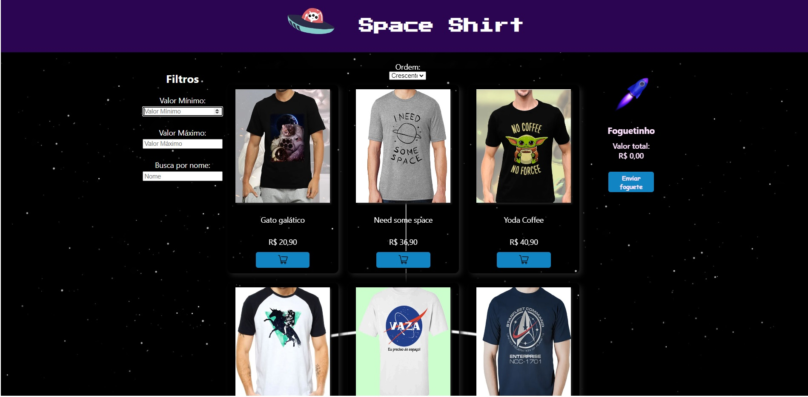
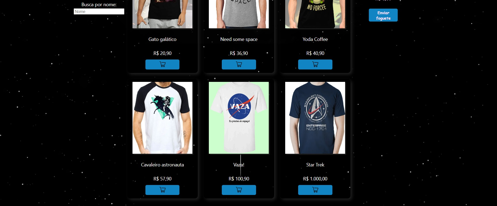

Projeto Star Shirt

Star Shirt é uma loja de camisetas divertidas e estilosas, todas com um toque espacial.
A Star Shirt tem um filtro funcional onde podemos selecionar por valor minimo, máximo e por nome.
As camisetas podem ser colocadas e retiradas facilmente do carrinho de compras além de também serem ordenadas em ordem crescente ou decrescente.

Esse projeto utilizou ReactJS.

Autores do projeto: 
Lucas Rafael Martins de Paula
Henrique dos Santos Rodriguez
Gabriela Tobias

 